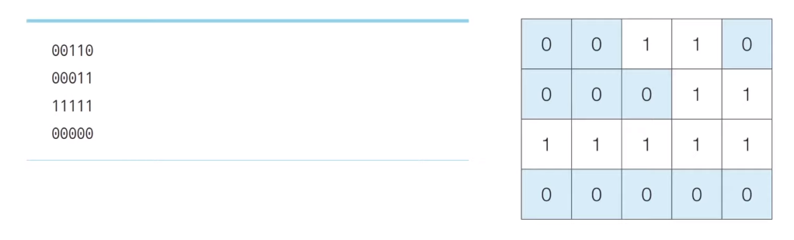
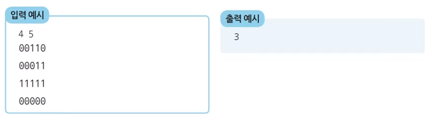
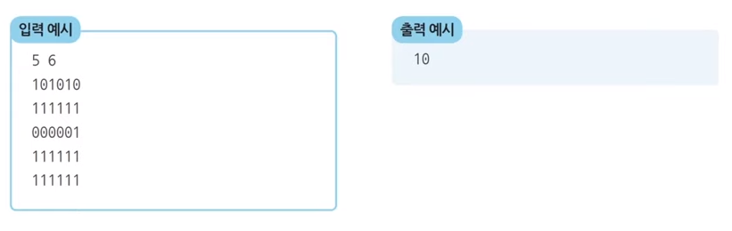

# DFS & BFS 기초 문제풀이

### 음료수 얼려 먹기

- N * M 크기의 얼음 틀이 있습니다. 구멍이 뚫려 있는 부분은 0, 칸막이가 존재하는 부분은 1로 표시됩니다. 구멍이 뚫려 있는 부분끼리 상, 하, 좌, 우로 붙어 있는 경우 서로 연결되어 있는 것으로 간주합니다. 
- 이때 <u>얼음 틀의 모양이 주어졌을 때 생성되는 총 아이스크림의 개수를 구하는 프로그램을 작성</u>하세요. 다음의 4 * 5 얼음 틀 예시에서는 아이스크림이 총 3개 생성됩니다. 





---

#### Python 답안 예시

```python
# DFS로 특정 노드를 방문하고 연결된 모든 노드들도 방문
def dfs(x, y) :
    # 주어진 범위를 벗어나는 경우 즉시 종료
    if x <= -1 or x >= n or y <= -1 or y >= m :
        return False
    
    # 현재 노드를 아직 방문하지 않았다면
    if graph[x][y] == 0 :
        # 해당 노드를 방문 처리
        graph[x][y] = 1
        
        # 상, 하, 좌, 우의 위치들도 모두 재귀적으로 호출
        dfs(x - 1, y)
        dfs(x, y - 1)
        dfs(x + 1, y)
        dfs(x, y + 1)
        
        return True
    return False

# N, M을 공백을 기준으로 구분하여 입력 받기
n, m = map(int, input().split())

# 2차원 리스트의 맵 정보 입력 받기
graph = []
for i in range(n) :
    graph.append(list(map(int, input())))

# 모든 노드(위치)에 대하여 음료수 채우기
result = 0
for i in range(n) :
    for j in range(m) :
        # 현재 위치에서 DFS 수행
        if dfs(i, j) == True :
            result += 1

# 정답 출력
print(result)
```

#### C++ 답안 예시

```c++
#include <bits/stdc++.h>

using namespace std;

int n, m;
int graph[1001][1001];

// DFS로 특정 노드를 방문하고 연결된 모든 노드들도 방문
bool dfs(int x, int y) {
    // 주어진 범위를 벗어나는 경우 즉시 종료
    if (x <= -1 || x >= n || y <= -1 || y >= m) {
        return false;
    }
    
    // 현재 노드를 아직 방문하지 않았다면
    if (graph[x][y] == 0) {
        // 해당 노드 방문 처리
        graph[x][y] = 1;
        
        // 상, 하, 좌, 우의 위치들도 모두 재귀적으로 호출
        dfs(x - 1, y);
        dfs(x, y - 1);
        dfs(x + 1, y);
        dfs(x, y + 1);
        
        return true;
    }
    
    return false;
}

int main() {
    // N, M을 공백을 기준으로 구분하여 입력 받기
    cin >> n >> m;
    
    // 2차원 리스트의 맵 정보 입력받기
    for (int i = 0; i < n; i++) {
        for (int j = 0; j < n; j++) {
            scanf("%1d", &graph[i][j]);
        }
    }
    
    // 모든 노드(위치)에 대하여 음료수 채우기
    int result = 0;
    for (int i = 0; i < n; i++) {
        for (int j = 0; j < m; j++) {
            // 현재 위치에서 DFS 수행
            if (dfs(i, j)) {
                result += 1;
            }
        }
    }
    
    cout << result << '\n'
}
```

#### Java 답안 예시

```java
import java.util.*;

public class Main {
    
    public static int n, m;
    public static int[][] graph = new int[1000][1000];

    // DFS로 특정 노드를 방문하고 연결된 모든 노드들도 방문
    public static boolean dfs(int x, int y) {
        // 주어진 범위를 벗어나는 경우 즉시 종료
        if (x <= -1 || x >= n || y <= -1 || y >= m) {
            return false;
        }

        // 현재 노드를 아직 방문하지 않았다면
        if (graph[x][y] == 0) {
            // 해당 노드 방문 처리
            graph[x][y] = 1;

            // 상, 하, 좌, 우의 위치들도 모두 재귀적으로 호출
            dfs(x - 1, y);
            dfs(x, y - 1);
            dfs(x + 1, y);
            dfs(x, y + 1);

            return true;
        }

        return false;
    }

    public static void main(String[] args) {
        Scanner sc = new Scanner(System.in);

        // N, M을 공백을 기준으로 구분하여 입력 받기
        n = sc.nextInt();
        m = sc.nextInt();
        sc.nextLine(); // 버퍼 지우기

        // 2차원 리스트의 맵 정보 입력 받기
        for (int i = 0; i < n; i++) {
            String str = sc.nextLine();

            for (int j = 0; j < m; j++) {
                graph[i][j] = str.charAt(j) = '0'
            }
        }

        // 모든 노드(위치)에 대하여 음료수 채우기
        int result = 0;
        for (int i = 0; i < n; i++) {
            for (int j = 0; j < m; j++) {
                // 현재 위치에서 DFS 수행
                if (dfs(i, j)) {
                    result += 1;
                }
            }
        }

        // 정답 출력
        System.out.println(result);
    }
}
```

---

### 미로 탈출

- 동빈이는 N * M 크기의 직사각형 형태의 미로에 갇혔습니다. 미로에는 여러 마리의 괴물이 있어 이를 피해 탈출해야 합니다. 
- 동빈이의 위치는 (1, 1)이며 미로의 출구는 (N, M)의 위치에 존재하며 한 번에 한 칸씩 이동할 수 있습니다. 이때 괴물이 있는 부분은 0으로, 괴물이 없는 부분은 1로 표시되어 있습니다. 미로는 반드시 탈출할 수 있는 형태로 제시됩니다. 
- 이때 동빈이가 탈출하기 위해 움직여야 하는 최소 칸의 개수를 구하세요. 칸을 셀 때는 시작 칸과 마지막 칸을 모두 포함해서 계산합니다. 



---

#### Python 답안 예시

```python
from collections import deque


# BFS 메소드 정의
def bfs(x, y):
    # 큐(Queue) 구현을 위해 deque 라이브러리 사용
    queue = deque()
    queue.append((x, y))

    # 큐가 빌 때까지 반복
    while queue:
        # 큐에서 원소를 뽑아 출력하기
        x, y = queue.popleft()

        # 현재 위치에서 4가지 방향으로의 위치 확인
        for i in range(4) :
            nx = x + dx[i]
            ny = y + dy[i]

            # 미로 찾기 공간을 벗어난 경우 무시
            if nx < 0 or nx >= n or ny < 0 or ny >= m :
                continue

            # 벽인 경우 무시
            if graph[nx][ny] == 0 :
                continue

            # 해당 노드를 처음 방문하는 경우에만 최단거리 기록
            if graph[nx][ny] == 1 :
                graph[nx][ny] = graph[x][y] + 1
                queue.append((nx, ny))
	
    # 가장 오른쪽 아래까지의 최단 거리 반환
    return maze[n - 1][m - 1]


# 미로의 가로, 세로 길이 입력
n, m = map(int, input().split())

# 미로 생성
graph = []
for i in range(n) :
    row = input()
    flag = []

    for j in range(m) :
        flag.append(int(row[j]))

    graph.append(flag)

# 이동할 4가지 방향 정의 (상, 하, 좌, 우)
dx = [-1, 1, 0, 0]
dy = [0, 0, -1, 1]

# 정의된 BFS 함수 호출
print(bfs(0, 0))
```

#### C++ 답안 예시

```c++
#include <bits/stdc++.h>

using namespace std;

int n, m;
int graph[201][201];

// 이동할 4가지 방향 정의 (상, 하, 좌, 우) 
int dx[] = {-1, 1, 0, 0};
int dy[] = {0, 0, -1, 1};

int bfs(int x, int y) {
    // 큐(Queue) 구현을 위해 queue 라이브러리 사용 
    queue<pair<int, int> > q;
    q.push({x, y});
    
    // 큐가 빌 때까지 반복하기 
    while(!q.empty()) {
        int x = q.front().first;
        int y = q.front().second;
        q.pop();
        
        // 현재 위치에서 4가지 방향으로의 위치 확인
        for (int i = 0; i < 4; i++) {
            int nx = x + dx[i];
            int ny = y + dy[i];
            
            // 미로 찾기 공간을 벗어난 경우 무시
            if (nx < 0 || nx >= n || ny < 0 || ny >= m) 
                continue;
            
            // 벽인 경우 무시
            if (graph[nx][ny] == 0) 
                continue;
            
            // 해당 노드를 처음 방문하는 경우에만 최단 거리 기록
            if (graph[nx][ny] == 1) {
                graph[nx][ny] = graph[x][y] + 1;
                q.push({nx, ny});
            } 
        } 
    }
    // 가장 오른쪽 아래까지의 최단 거리 반환
    return graph[n - 1][m - 1];
}

int main(void) {
    // N, M을 공백을 기준으로 구분하여 입력 받기
    cin >> n >> m;
    
    // 2차원 리스트의 맵 정보 입력 받기
    for (int i = 0; i < n; i++) {
        for (int j = 0; j < m; j++) {
            scanf("%1d", &graph[i][j]);
        }
    }
    
    // BFS를 수행한 결과 출력
    cout << bfs(0, 0) << '\n';
    return 0;
}
```

#### Java 답안 예시

```java
import java.util.*;

// 노드 상태를 저장할 class 생성
class Node {

    private int index;
    private int distance;

    public Node(int index, int distance) {
        this.index = index;
        this.distance = distance;
    }

    public int getIndex() {
        return this.index;
    }
    
    public int getDistance() {
        return this.distance;
    }
}

public class Main {

    public static int n, m;
    public static int[][] graph = new int[201][201];

    // 이동할 4가지 방향 정의 (상, 하, 좌, 우) 
    public static int dx[] = {-1, 1, 0, 0};
    public static int dy[] = {0, 0, -1, 1};

    public static int bfs(int x, int y) {
        // 큐(Queue) 구현을 위해 queue 라이브러리 사용 
        Queue<Node> q = new LinkedList<>();
        q.offer(new Node(x, y));
        
        // 큐가 빌 때까지 반복하기 
        while(!q.isEmpty()) {
            Node node = q.poll();
            x = node.getIndex();
            y = node.getDistance();
            
            // 현재 위치에서 4가지 방향으로의 위치 확인
            for (int i = 0; i < 4; i++) {
                int nx = x + dx[i];
                int ny = y + dy[i];
                
                // 미로 찾기 공간을 벗어난 경우 무시
                if (nx < 0 || nx >= n || ny < 0 || ny >= m) 
                    continue;
                
                // 벽인 경우 무시
                if (graph[nx][ny] == 0)
                    continue;
                
                // 해당 노드를 처음 방문하는 경우에만 최단 거리 기록
                if (graph[nx][ny] == 1) {
                    graph[nx][ny] = graph[x][y] + 1;
                    q.offer(new Node(nx, ny));
                } 
            } 
        }
        // 가장 오른쪽 아래까지의 최단 거리 반환
        return graph[n - 1][m - 1];
    }

    public static void main(String[] args) {
        Scanner sc = new Scanner(System.in);

        // N, M을 공백을 기준으로 구분하여 입력 받기
        n = sc.nextInt();
        m = sc.nextInt();
        sc.nextLine(); // 버퍼 지우기

        // 2차원 리스트의 맵 정보 입력 받기
        for (int i = 0; i < n; i++) {
            String str = sc.nextLine();
            for (int j = 0; j < m; j++) {
                graph[i][j] = str.charAt(j) - '0';
            }
        }

        // BFS를 수행한 결과 출력
        System.out.println(bfs(0, 0));
    }

}
```

> 코드 출처 : 동빈나 님 https://github.com/ndb796/python-for-coding-test/tree/master/5