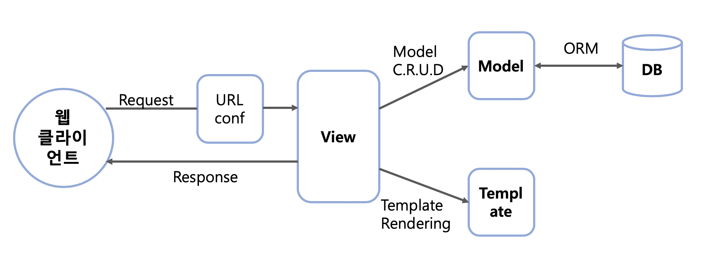

# Django WebFramework

* **MVT** WebFramework
* M : Model, V : View, T : Template
* MVT 패턴에 의한 처리 과정
  1. 클라이언트에서 서버로 request 발생
  2. URLConf를 통해 해당 요청의 처리를 담당할 view 결정
  3. view가 자신의 로직을 실행하면서 request에 대한 처리를 진행
  4. 로직을 실행하면서 DB의 처리가 필요하다면 model을 통해 처리하고 결과를 반환
  5. view는 자신의 로직 처리가 끝나면 template을 사용하여 클라이언트에 전송할 HTML 파일 생성
  6. 최종 결과로 HTML 파일을 클라이언트에게 보내 응답




* URLConf : URL 정의
  * 클라이언트로부터 받은 요청에 들어있는 URL이 urls.py 파일에 정의된 URL 패턴과 매칭되는지 분석
  * urls.py 파일에 URL과 View를 mapping하는 코드 작성
* View : 로직 정의
  * 웹의 요청을 받아서 해당 어플리케이션의 로직에 맞는 처리를 진행
  * 처리 결과 데이터를 HTML로 변환하기 위해 템플릿 처리를 한 후 최종 HTML로 된 응답 데이터를 웹 클라이언트로 반환
  * 보통 별도의 템플릿 파일에 HTML 코드를 작성하고, View는 이 별도로 작성된 템플릿 파일을 해석
* Template : 화면 UI 정의
  * 개발자가 응답에 사용할 *.html  파일을 작성
  * 장고는 이를 해석해서 최종 HTML 텍스트 응답을 생성하고, 클라이언트에게 전송
* Model : 데이터베이스(테이블) 정의
  * 사용할 데이터에 대한 정의를 담고 있는 class
  * 모델의 class를 기반으로 데이터베이스의 테이블 생성

---


## 1. 프로젝트 만들기

> python 터미널에서 실행

```terminal
>django-admin startproject djangoWEB
>cd djangoWEB
```

* `djangoWEB` 이라는 이름의 프로젝트 생성
* 프로젝트 폴더로 이동


```
>python manage.py startapp helloApp
```

* `helloApp` 이라는 이름의 app 생성

---


## 2. 프로젝트 다루기

### (1) djangoWEB

* settings.py

  * 웹서버의 기본 설정 정보가 있는 python  파일

  

  * ```python
    ALLOWED_HOSTS = ['127.0.0.1', 'localhost']
    ```
    * 서버의 IP를 명시해주는 곳

    

  * ```python
    INSTALLED_APPS = [
        'django.contrib.admin',
        'django.contrib.auth',
        'django.contrib.contenttypes',
        'django.contrib.sessions',
        'django.contrib.messages',
        'django.contrib.staticfiles',
        'helloApp',
    ]
    ```

    * 웹서버에서 만든 app을 등록을 해주는 곳
    * `helloApp` 등록
    * 등록하지 않을 경우, **프로젝트 진행이 불가능하다**.

    

  * ```python
    ROOT_URLCONF = 'djangoWEB.urls'
    ```

    * 웹서버의 root url 표시

  

  * ```python
    TIME_ZONE = 'Asia/Seoul'
    ```

    * 시간을 현재 장소에 맞게 변경

    

* urls.py

  * 사용자가 요청한 url 주소를 어디로 보낼지 결정하는 python 파일

  

  * ```python
    from django.contrib import admin
    from django.urls import path, include
    
    urlpatterns = [
        path('admin/', admin.site.urls),
        path('hello/', include('helloApp.urls')),
    ]
    ```

    * `include` 함수는 `import` 필수
    * `path('admin/', admin.site.urls)`
    * url에 `admin/` 이 들어가게 되면 관리자 브라우저로 넘어가게 하는 default path

    

    * `path('hello/', include('helloApp.urls'))`
    * url에 `hello/ ` 가 들어가게 되면 helloApp의 urls.py으로 전송하여 `hello/` 의 하위 url을 분류

    

    * **URLConf**


### (2) helloApp

* urls.py

  * `djangoWEB`의 urls.py에서 분류되어 오는 url(사용자의 요청)을 다시 분류하는 python 파일

  

  * ```python
    from django.contrib import admin
    from django.urls import path, include
    from helloApp import views
    
    urlpatterns = [
        path('index/', views.index),
        path('hi/', views.hi),
        path('login/', views.login, name='login')
    ]
    ```

    * `views ` 를 사용하려면 먼저 import하는 작업이 필요 (views.py 사용)
    * `path('index/', views.index)`
    * 사용자가 요청한 url이 `hello/index/` 인 경우, `views.py` 에 있는 이름이 `index`인 view를 보여준다.

    

    * `path('hi/', views.hi)`
    * 사용자가 요청한 url이 `hello/hi/` 인 경우, `views.py` 에 있는 이름이 `hi`인 view를 보여준다.

    

    * `path('login/', views.login, name='login')`
    * 사용자가 어떠한 view에서 이름이 `login` 이라는 요청을 보냈을 경우, ``views.py`` 에 있는 이름이 `login` 인 view를 보여준다.

    

    * url의 이름과 view의 이름이 꼭 같을 필요는 없다.
    * **URLConf**


* views.py

  * 사용자의 요청에 해당하는 view를 만들어놓는 python 파일
  * 요청을 받은 즉시 response를 할 수 있고, html문서를 불러와서 보여줄 수도 있다.
  * html 문서들은 **templates** 폴더 아래에 저장한다.

  

  * ```python
    from django.shortcuts import render, HttpResponse
    from .models import *
    
    # Create your views here.
    
    def index(request) :
        # return HttpResponse('<div align=center>Django WEB Framework</div>')
        return render(request, 'hello/index.html')
    
    
    def hi(request) :
        context = {'ment' : 'rest time'}
        return render(request, 'hello/ok.html', context)
    
    
    def login(request) :
        if request.method == 'POST' :
            id = request.POST['id']
            pwd = request.POST['pwd']
    
            # select * from TestUser where id = id;
            user = TestUser.objects.get(user_id = id)
            context = {}
    
            if user is not None :
                context['user'] = user
    
            return render(request, 'hello/success.html', context)
    ```

    * ```python
      def index(request) :
          # return HttpResponse('<div align=center>Django WEB Framework</div>')
          return render(request, 'hello/index.html')
      ```

    * 사용자의 요청이 `index` 일 경우 실행

    * `HttpResponse` , `render` 함수를 쓰기 위해서 import 필요

    * `HttpResponse` 함수는 요청을 받음과 동시에 view를 생성하여 보여준다.

    * `render` 함수는 만들어져있는 파일(html)을 불러와서 view로 보여준다.

      * ```html
        <!DOCTYPE html>
        <html lang="en">
        <head>
            <meta charset="UTF-8">
            <title>Title</title>
        </head>
        <body>
            <center>Naver</center>
            <div align="right">
                <form method="post" action="">
        
                    
        
                    <label>아이디</label> <input type="text" name="id" />
                    <label>패스워드</label> <input type="password" name="pwd" />
                    <input type="submit" value="LOGIN" />
                </form>
            </div>
        </body>
        </html>
        ```

      * index.html

      * `input` 에서 입력한 아이디와 패스워드는 각각 id, pwd라는 이름을 가지고,

      * `submit` 버튼을 누르면 `action=""` 이 실행되고,

      * url이 `login/` 인 요청을 발생시킨다.

    

    

    * ```python
      def hi(request) :
          context = {'ment' : 'rest time'}
          return render(request, 'hello/ok.html', context)
      ```

    * 사용자의 요청이 `hi` 일 경우 실행

    * dictionary 형식의 `context` 변수를 만들어 view에 출력이 가능하다.

      * ```html
        <!DOCTYPE html>
        <html lang="en">
        <head>
            <meta charset="UTF-8">
            <title>Title</title>
        </head>
        <body>
            <center><font color="red">{{ment}}</font></center>
        </body>
        </html>
        ```

      * ok.html

      * `{{ment}}` : 전달받은 `context` 의 key(`ment`)에 대한 value를 출력

    

    

    * ```python
      def login(request) :
          if request.method == 'POST' :
              id = request.POST['id']
              pwd = request.POST['pwd']
      
              # select * from TestUser where id = id;
              user = TestUser.objects.get(user_id = id)
              context = {}
      
              if user is not None :
                  context['user'] = user
      
              return render(request, 'hello/success.html', context)
      ```

    * 사용자의 요청이 `login` 일 경우 실행

    * 직접 `hello/login/` url로 접속은 할 수 있지만, 전달받은 value가 없어서 error가 발생한다.

    * index.html에서 `login` 요청이 발생하면 실행이 된다.

    

    * ```python
      if request.method == 'POST' :
          id = request.POST['id']
          pwd = request.POST['pwd']
      ```

    * 전송방식이 POST 방식이면 새로운 변수 `id` , `pwd` 에 각각 이름이 id, pwd인 전송받은 값을 저장한다.

    

    * ```python
      user = TestUser.objects.get(user_id = id)
      ```

    * `TestUser` 객체(model)를 통해 만든 서버의 계정들 중에서 전송받은 id와 같은 id의 계정(객체)를 `user` 변수에 저장한다. (모델, 객체에 대한 내용은 아래 참조)

    * 만약 같은 id가 없다면 `None` 을 반환한다.

    

    * ```python
      context = {}
      
      if user is not None :
          context['user'] = user
      
      return render(request, 'hello/success.html', context)
      ```

    * 데이터타입이 dictionary인 `context` 변수 생성 

    * `user` 변수가 `None` 이 아니면 계정이 있다는 것을 의미하므로 `context` 에 `user` 정보를 저장

    * `render` 함수로 success.html 문서에 `context` 를 전해주며 view로 보여준다.

      * ```html
        <!DOCTYPE html>
        <html lang="en">
        <head>
            <meta charset="UTF-8">
            <title>Title</title>
        </head>
        <body>
            아이디 {{user.user_id}}, 비밀번호 {{user.user_pwd}}, 이름 {{user.user_name}}
        </body>
        </html>
        ```

      * success.html

      * `context` 변수에 저장된 key(`user` ,  객체)에 해당하는 value값을 출력


* models.py

  * DB의 table을 생성하기 위한 데이터의 정의를 선언하는 python 파일

  * ```python
    from django.db import models
    
    # Create your models here.
    
    class TestUser(models.Model) :
        user_id = models.CharField(max_length=50)
        user_pwd = models.CharField(max_length=50)
        user_name = models.CharField(max_length=50)
    ```

    * `TestUser` class 생성
    * 만들어지는 class들은 models의 Model을 상속받는다. 
    * 결론적으로, `TestUser` table과 `user_id` , `user_pwd` , `user_name` 3개의 column을 생성하게 된다.

    

  > python 터미널에서 실행

  * ```
    >python manage.py makemigrations
    >python manage.py migrate
    ```

    *  models.py에 정의된 class를 기반으로 데이터베이스에 테이블을 생성하는 작업 (migration)


* admin.py

  * 서버 사용자들의 계정을 관리하기 위한 python 파일

  * ```python
    from django.contrib import admin
    from .models import *
    
    # Register your models here.
    admin.site.register(TestUser)
    ```

    * 사용자들의 정보를 TestUser class 형식으로 저장할 수 있도록 설정

  

  > python 터미널에서 실행

  * ```
    >python manage.py createsuperuser
    ```

    * 관리자의 id, email, password를 생성하는 작업

  

  * `path('admin/', admin.site.urls)` 에서 default path로 이미 정의

  * `admin/` 으로 url에 접속하게 되면 관리자의 id와 password를 입력한 후 계정 관리가 가능하다.

---


## 3. 프로젝트 실행

* Server 실행


> python 터미널에서 실행

* ```
  >python manage.py runserver
  ```
  * 서버 주소는 settings.py에서 설정한 `127.0.0.1:8000/` 또는 `localhost:8000/` 으로 접속